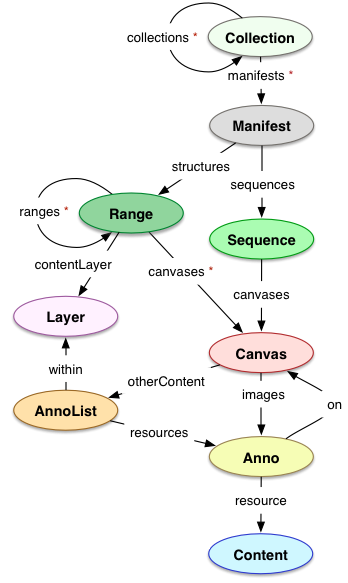
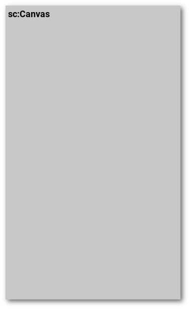
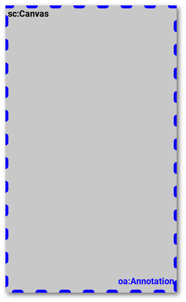

title: IIIF
class: animation-fade
layout: true

.bottom-bar[

]

---

class: impact


## Offene und entwicklerfreundliche APIs für digitales Kulturerbe
### Oder: Von bibliothekarischen Standards zu Web-Standards

---

**Johannes Baiter**

.link-logo[[ jbaiter](https://github.com/jbaiter)]</br>
.link-logo[[ jbaiter_](https://twitter.com/jbaiter_)]

**Bayerische Staatsbibliothek**

.link-logo[[ dbmdz](https://github.com/dbmdz)]</br>
.link-logo[[ IIIF-Sammlungen](https://iiif.digitale-sammlungen.de)]<br/>

----

**Folien:** https://jbaiter.de/iiif_dhberlin

**IIIF-Spielwiese**: https://app.digitale-sammlungen.de/demo/iiif

---
class: center, middle

# Ausgangspunkt: Digitalisate online stellen

---
class: center, middle, no-bottom-bar
background-image: url(./assets/img/viewerchaos.jpg)

---

# Jeder kocht sein eigenes Süppchen
- **Millionen** digitalisierte Kulturgüter mit **Milliarden** von
  hochauflösenden Bildern weltweit
- Verknüpfungen zwischen Objekten nur schwierig realisierbar, kein Tooling
  das übergreifend funktioniert
- Hunderte verschiedene Viewer mit ebenso vielen unterschiedlichen Methoden
  um auf die Bilder zuzugreifen
- Sehr schwierig Tooling zu entwickeln dass mit vielen Quellen umgehen kann

---

class: video-full, no-bottom-bar

<video controls muted>
    <source src="./assets/video/dragdrop.mp4" type="video/mp4">
</video>

---

# IIIF: International Image Interoperability Framework

- Internationale Community, offen für alle (http://iiif.io/community/)
- **Ziele**:
  - Entwicklung von offenen Standards für die Präsentation von digitalen
    Kulturdaten
  - Nutzerfreundlichkeit
  - Entwicklerfreundlichkeit (Stichwort: *Linked Open **Usable** Data*)

---

# IIIF: International Image Interoperability Framework

- Beginn der Entwicklungen 2011, Zusammenarbeit von u.a. British Library,
  Stanford, Oxford, BNF
- Seit 2015: Organisiert im **IIIF Consortium**, Förderung von Entwicklung,
  Organisation von Events, über 40 Mitgliedsinstitutionen weltweit
  (http://iiif.io/community/consortium/)
- **Wichtig:** Konsortium rein unterstützend, alle wichtigen Entscheidungen
  und Standards werden von der Community verabschiedet, die jedem offen
  steht (Mailing Liste, Slack, Regelmäßige Konferenz-Calls)

---

# Kern-APIs
- **Image API:** Bereitstellung der Pixeldaten der digitalen Objekte über
  einheitliches Interface
- **Presentation API:** Metadaten-Format für die Präsentation von
  digitalen Kulturobjekten:<br/>
  > Just enough metadata to drive a remote viewing experience
- Daneben: Content Search API (Volltextsuche in einzelnen Digitalisaten),
  Authentication (Zugriffskontrollen)

---

# Image API: Bildinformationen

.center.small.bold[`<scheme>://<server>/<prefix>/<identifier>/info.json`]

JSON-LD Dokument mit technischen Metadaten über ein Bild:

- Abmessungen
- Unterstützte Bildoperationen
- Unterstützte Bildgrößen, Kachelgrößen

---

# Image API: Bildinformationen

.small[https://api.digitale-sammlungen.de/iiif/image/v2/bsb00032721_00008/info.json]

```json
{
  "@context": "http://iiif.io/api/image/2/context.json",
  "@id": "https://api.digitale-sammlungen.de/iiif/image/v2/bsb00032721_00008",
  "protocol": "http://iiif.io/api/image",
  "profile": "http://iiif.io/api/image/2/level2.json",
  "width": 3120,
  "height": 4548,
  "sizes": [
    { "width": 2340, "height": 3411 },
    { "width": 390, "height": 569 }
  ],
  "tiles": [
    { "width": 1024, "scaleFactors": [1, 2, 4, 8, 16] }
  ]
}
```


---

# Image API: Bildtransformationen

.center.smaller.bold[`<scheme>://<server>/<prefix>/<identifier>/<region>/<size>/<rotation>/<quality>.<format>`]

- Ausschneiden einer bestimmten Bildregion
- Skalierung des Bildausschnits
- Rotation des Bildausschnitts
- Auswahl der Farbtiefe (farbig, Grautstufen, bitonal)
- Auswahl des Bildformats (JPEG, PNG, etc.)

---
class: center, middle

.smaller[https://api.digitale-sammlungen.de/iiif/image/v2/bsb00032721_00008/full/,400/0/default.jpg]


.image-param[/full/.primary[,400]/0/default.jpg]


---
class: center, middle

.smaller[https://api.digitale-sammlungen.de/iiif/image/v2/bsb00032721_00008/440,2274,2090,1190/,400/0/default.jpg]


.image-param[/.primary[440,2274,2090,1190]/,400/0/default.jpg]

---

- **Grundidee:** Benutzer (mit und ohne Bewusstsein) sollen Daten direkt von
  der Quelle nutzen, die häufigsten Bildoperationen sollten direkt auf dem Server
  passieren
- **Vorteile:**
  - Für Nutzer: Sehr einfache Nachnutzung, einfach das gewünschte Bild direkt einbinden
  - Für Bereitsteller: Einfache Nachverfolgung von Nutzungszahlen und -kontexten (per  HTTP Referer)
  - Für Entwickler: Nur die Bilddaten abholen, die man wirklich benötigt, keine
    eigenen Transformationen notwendig

---

# Presentation API: "Metadaten"

.center[]

---

# Presentation API: "Metadaten"

- Metadaten-Standards gibt es wie Sand am Meer
- Problem: Zwangsläufig sehr komplex, Komplexität für viele Einsatzbereiche
  überflüssig
- **Behauptung:** Mit MarcXML oder MODS arbeitet niemand gerne, besonders
  wenn er nicht aus dem bibliothekarischen Umfeld kommt

---

# Presentation API: "Metadaten"

- Was wollen wir eigentlich?
  - Ein potentiell sehr komplexes digitales Objekt zur Betrachtung
  präsentieren
  - Die Präsentation benutzerfreundlich gestalten
  - Die Hürde für Entwickler aller Couleur möglichst niedrig halten

--

→ **Deskriptive Semantik vs. Präsentations-Semantik**

---

# Exkurs: Deskriptive Semantik

```xml
<mods:name type="personal" valueURI="http://d-nb.info/gnd/118630067">
  <mods:namePart type="given">Christoph</mods:namePart>
  <mods:namePart type="family">Weigel</mods:namePart>
  <mods:displayForm>Weigel, Christoph</mods:displayForm>
  <mods:role>
    <mods:roleTerm authority="marcrelator" type="code"
        valueURI="http://id.loc.gov/vocabulary/relators/aut">
      aut
    </mods:roleTerm>
  </mods:role>
</mods:name> 
```

---

# Exkurs: Deskriptive Semantik

```xml
<mods:name type="personal" valueURI="http://d-nb.info/gnd/118630067">
  <mods:namePart type="given">Christoph</mods:namePart>
  <mods:namePart type="family">Weigel</mods:namePart>
* <mods:displayForm>Weigel, Christoph</mods:displayForm>
  <mods:role>
    <mods:roleTerm authority="marcrelator" type="code"
        valueURI="http://id.loc.gov/vocabulary/relators/aut">
      aut
    </mods:roleTerm>
  </mods:role>
</mods:name>
```

---

# Präsentations-Semantik

```json
{
  "label": "Author",
  "value": "Weigel, Christoph"
}
```

---

# Präsentations-Semantik

```json
{
  "label": [
    { "@language": "en",
      "@value": "Author" },
    { "@language": "de",
      "@value": "Autor" }],
  "value": "Weigel, Christoph"
}
```

---

# Presentation API
.col-4.sc-model[
  
]

.col-8[
- Definiert ein **Modell** um über digitale Repräsentationen zu sprechen:<br/>
  **Shared Canvas** (http://iiif.io/model/shared-canvas/1.0/)
- Definiert ein **Format** das das Modell implementiert und mit dem Software
  die digitalen Repräsentationen sichtbar machen kann
]

---

# Presentation API: Das Manifest
- Ein Manifest pro Buch, Gemälde, Film, Skulptur, Handschrift, Landkarte, etc
- "Das was vom Benutzer in einem Viewer geöffnet wird"

---

# Das IIIF Manifest
- Maschinenlesbares Dokument das digitale Objekte **präsentiert**
  (nicht **beschreibt**!)
- **JSON-LD:** Linked Data, soweit möglich werden vorhandene Vokabulare verwendet
  (Dublin Core, FOAF, RDF, EXIF, siehe [JSON-LD Kontext](http://iiif.io/api/presentation/2/context.json))

---

# Das IIIF Manifest
- **Grundprinzip:**<br/>
    Ein Manifest definiert eine Abfolge von einem oder mehreren **abstrakten
    Räumen**, in denen mittels einer Annotation **Inhalte abgebildet werden**
    können
- Nicht nur der Urheber kann Aussagen über diese abstrakten Räume
  treffen, andere können diese ebenfalls annotieren und auf das Ziel verweisen

---

# Das IIIF Manifest

```json
{
  "@context": "http://iiif.io/api/presentation/2/context.json",
* "@type": "sc:Manifest",
  "@id": "https://…/iiif/presentation/v2/bsb00032721/manifest",
  "label": "Ottheinrich-Bibel, Bd. 4: Joh 5,18 - Röm 15,13 - BSB Cgm 8010(4",
* "metadata": [ … ],
  "sequences": [
    {
      "@id": "https://…/iiif/presentation/v2/bsb00032721/sequences/normal",
*     "@type": "sc:Sequence",
      "canvases": [ … ]
    }
}
```

---

# Ein Canvas für den Raum…

.col-4.sc-model[
  
]
.col-8[
```json
{
  "@id": "https://…/bsb00032721/sequences/normal",
  "@type": "sc:Sequence",
* "canvases": [
    {
      "@id": "https://…/bsb00032721/canvas/1",
*     "@type": "sc:Canvas",
      "label": "(0001)",
      "width": 3258,
      "height": 4680,
      "images": [ … ]
    }
  ]
}
```
]

---

# … Annotationen für den Inhalt
.col-4.sc-model[
  
]
.col-8[
```json
{
  "@id": "https://…/bsb00032721/canvas/1",
  "@type": "sc:Canvas",
* "images": [
    {
*     "@type": "oa:Annotation",
      "motivation": "sc:painting",
      "on": "https://…/bsb00032721/canvas/1",
      "resource": { … }
    }
  ]
}
```
]

---

# … Annotationen für den Inhalt
.col-4.sc-model[
  
]
.col-8[
```json
{
  "@type": "oa:Annotation",
  "resource": {
    "@id": "…/image/bsb00032721_00001/full/full/0/default.jpg",
*   "@type": "dctypes:Image",
    "format": "image/jpeg",
    "width": 3258,
    "height": 4680,
*   "service": {
      "@context": "http://iiif.io/api/image/2/context.json",
*     "@id": "…/image/bsb00032721_00001",
      "profile": "http://iiif.io/api/image/2/level2.json",
      "protocol": "http://iiif.io/api/image"
    }
  }
}
```
]

---

# Use Case: Rekonstruktion einer Handschrift

- Bibiliothek A hat eine Handschrift erworben, aber alle Illuminationen
  wurden zu einem früheren Zeitpunkt herausgeschnitten
- Bibliothek B entdeckt in einem Nachlass einen Teil der herausgeschnittenen
  Illuminationen
- Beide Bibliotheken stellen ihre Bilder über IIIF zur Verfügung

→ Wir können die Handschrift digital rekonstruieren!

---
class: no-bottom-bar
background-image: url(./assets/img/reconstruction1.jpg)

---
class: no-bottom-bar
background-image: url(./assets/img/reconstruction2.jpg)

---
class: no-bottom-bar, center, middle
background-image: url(./assets/img/reconstruction3.jpg)

--

.small.title-backdrop[
http://projectmirador.org/demo/advanced_features.html
]

---

# Metadaten?
- Wie gesagt, "just enough to drive a viewer": Mehrsprachige, menschenlesbare,
  Key-Value Paare
- Alle weiteren deskriptiven Metadaten über `seeAlso` Schlüssel im Manifest
  einbinden
- **Problematisch** für Discovery: Wie finde ich überhaupt IIIF Manifeste
  wenn ich keine einheitlichen maschinenlesbaren deskriptiven Metadaten habe?

---

# METS/MODS?
METS/MODS wird jetzt schon für den Use Case "Viele Bibliotheken, ein Viewer"
(DFG-Viewer) eingesetzt, hat jedoch hier im Vergleich zu IIIF einige Nachteile:

- Komplexität hinderlich bei der Entwicklung von übergreifenden Viewern
- XML mit zig Namespaces und Pointer-Dschungel macht keine Freude
- Kein Linked Data

---

# METS/MODS?

METS ist jedoch für Nicht-Präsentations Use Cases besser geeignet als IIIF:

- Ausführliche deskriptive Metadaten
- Etabliert in vielen Workflows
- Erleichtert Verwaltung von assoziierten Dateien: Hashes, Dateisystempfade

---

# Schritte zu IIIF: Image API
- Große Menge an Open Source Image-Servern die IIIF unterstützen
- Klassiker: [IIPImage](http://iipimage.sourceforge.net) (C++, FastCGI)
- Speziell für IIIF: [Loris](https://github.com/loris-imageserver/loris) (Python),
  [Cantaloupe](https://github.com/medusa-project/cantaloupe) (Java),
  [Hymir](https://github.com/dbmdz/iiif-server-hymir) (Java)
- Setup relativ einfach:
    1. Bilder für den Image-Server zugänglich machen (Lokales Volume, NAS, S3,
       HTTP, etc)
    2. Mapping von Identifier auf Bild-Pfad konfigurieren

---

# Schritte zu IIIF: Presentation API
- **Handarbeit** notwendig: Mapping hauseigener Formate auf IIIF-Manifeste
- Drei Haupt-Schritte:
    * Metadaten-Schema in menschenlesbare (Key, Value) Paare mappen
    * Reihenfolge der Seiten und Bildabmessungen ermitteln, auf Image API
      verweisen
    * Seiten "Table of Contents" Strukturen zuordnen

---

# Schritte zu IIIF: Presentation API

Die Community hat eine Reihe von Libraries entwickelt um die Erstellung von
Manifesten zu vereinfachen:

- [iiif-prezi](https://github.com/iiif-prezi/iiif-prezi) (Python, Referenzimplementierung)
- [Manifesto](https://github.com/UniversalViewer/manifesto) (JavaScript)
- [O'Sullivan](https://github.com/IIIF/osullivan) (Ruby)
- [iiif-apis](https://github.com/dbmdz/iiif-apis) (Java)

---

# Schritte zu IIIF: Presentation API

Web-Service für IIIF-Manifeste aus METS nach DFG-Schema:

.center[
https://demetsiiify.jbaiter.de
]

- Konvertiert METS-Dokumente in JSON-LD Manifeste
- Stellt *Wrapper* Image API bereit: Requests werden auf bestehende
  Bild-Endpunkte des Dateninhabers weitergeleitet
- Open Source (AGPL)
- Verwendung als Kommandozeilen-Tool in Vorbereitung

---

# Schritte zu IIIF

Nützliche Resource

.center[
https://github.com/IIIF/awesome-iiif
]

Von der Community betreutes Verzeichnis an IIIF-Software, -Projekten, -Demos,
-Voträgen, uvm.

---

# IIIF-Entwicklungen: Mehr Dimensionen!

- Presentation API 3 wird Unterstützung für zeitliche Dimension mitbringen
- Erste Arbeiten in Richtung 3D-Support

---
class: middle, center, no-bottom-bar
background-image: url(./assets/img/iiif_audio.jpg)

.title-backdrop[
**https://www.kanzaki.com/works/2016/pub/image-annotator?u=/works/2017/annot/tchaiko-serenade-2mov/manifest&mz=2**
]

---
class: middle, center, no-bottom-bar
background-image: url(./assets/img/nefertiti.jpg)

.title-backdrop[
**http://www.kanzaki.com/works/2016/pub/image-annotator?u=/works/2018/threed/nefertiti-manifest.json**
]

---
class: middle, center

# Fragen?

## Weiterführende Links

An Introduction to IIIF (Tom Crane, Digirati)<br/>
http://resources.digirati.com/iiif/an-introduction-to-iiif/

Awesome IIIF<br/>
https://github.com/IIIF/awesome-iiif

IIIF Community<br/>
http://iiif.io/community/
